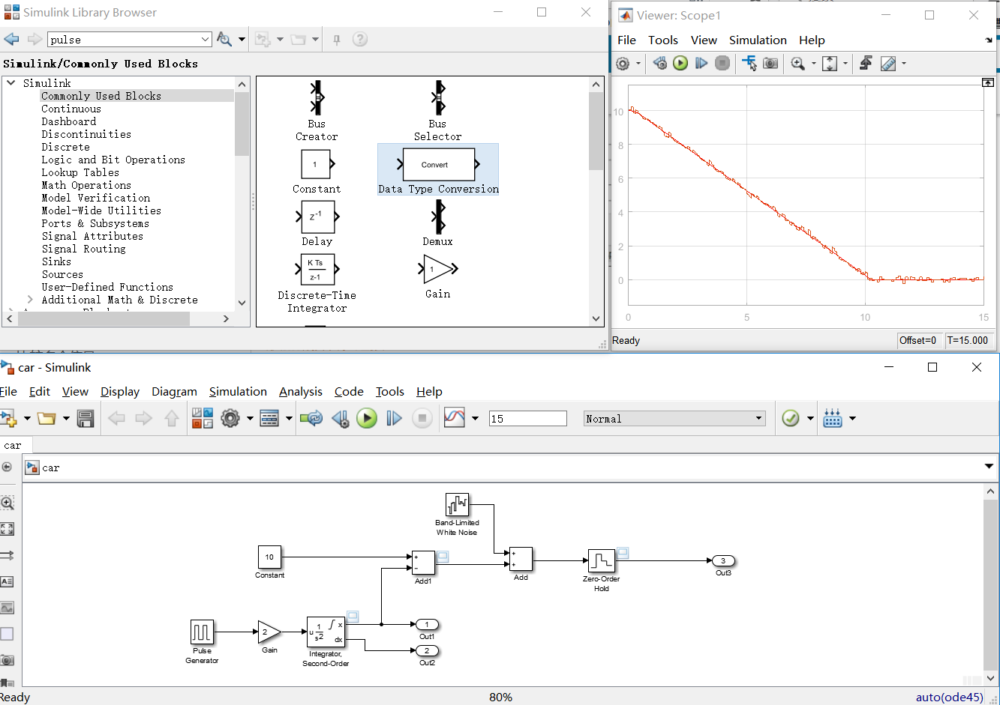

# 四轴飞行器

## index

[TOC]

TODOs:

- 对matlab-simulink的学习  

- 找一个现成的库或者工程[][id]

- 对其中各个部分/参数的理解、调整，并尝试搞清楚他们的影响

### 对matlab-simulink的简单学习[1]

通过Mathwork提供的simulink教程来进行入门的学习:

示例仿真了在踩下汽车踏板后简化的汽车运动

#### 简化的汽车运动

该运动考虑以下三个问题:

- 汽车在到达障碍物时会紧急刹车。
- 在现实世界中，传感器对距离的测量不够精确，从而导致随机数值误差。
- 数字传感器以固定时间间隔运行。

下图为仿真结果图

仿真描绘了在汽车踩下踏板后的运动(只踩了一下且不考虑摩擦),使用了脉冲信号,放大环节,积分环节并引入了噪声,最后进行可视化输出.

图中示波器红线表示汽车与障碍物的实际距离,棕线表示传感器的测量值.
可出传感器的测量不够精确导致的随机误差,并且传感器的采样距离0.1s.

#### 模拟一个啥呢?这一部分除官方说明文档外无参考,题目自拟

某弹簧秤,拉着未知负载,需要保证负载高度稳定,输出弹簧秤高度,使用PID控制
1. 模拟一个负载不随时间变化的过程
2. 模拟一个负载随时间不规则变化的过程

一些参数:
$
g=9.8m/s^2 \quad
k=100PID1400N/m \quad
目标高度:1m \quad
初始高度:0m \quad1
弹簧长: 300mm \quad
物重:500g \quad
弹簧秤重:50g
$

弹簧初始处于松弛状态
控制方式为向弹簧秤顶端加减力

控制方法:绝对PID啊

### 找一个现成的库或者工程[2-3]

发现了一个叫做Wil Selby的Ouster工程项目经理开源的

## reference:
[1]  https://ww2.mathworks.cn/help/simulink/gs/create-a-simple-model.html  
[2] https://github.com/wilselby/MatlabQuadSimAP  
[3] https://www.wilselby.com/research/arducopter/simulation-environment/  
[3] 

[]:

